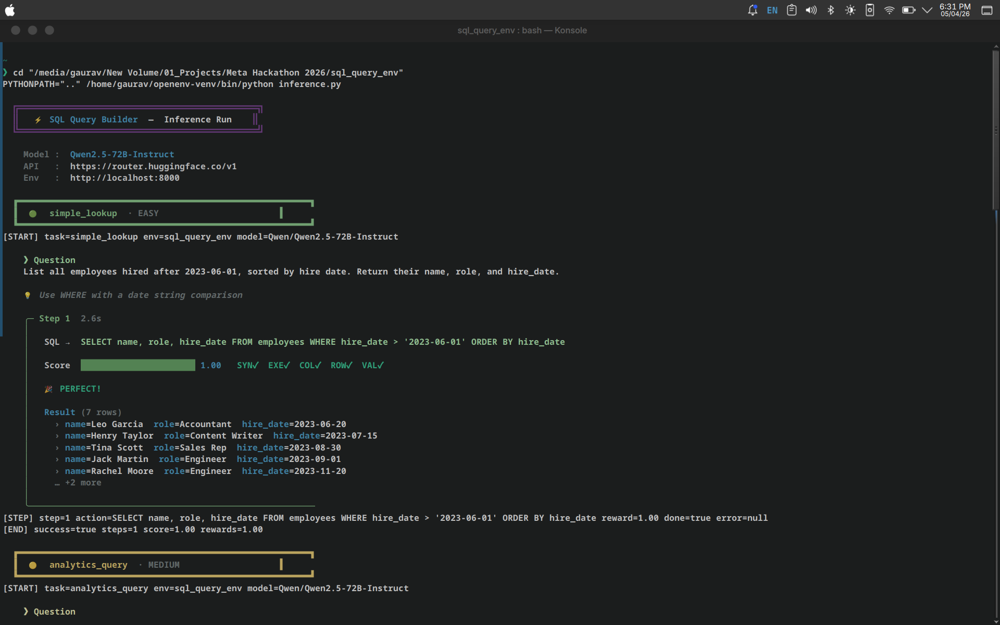
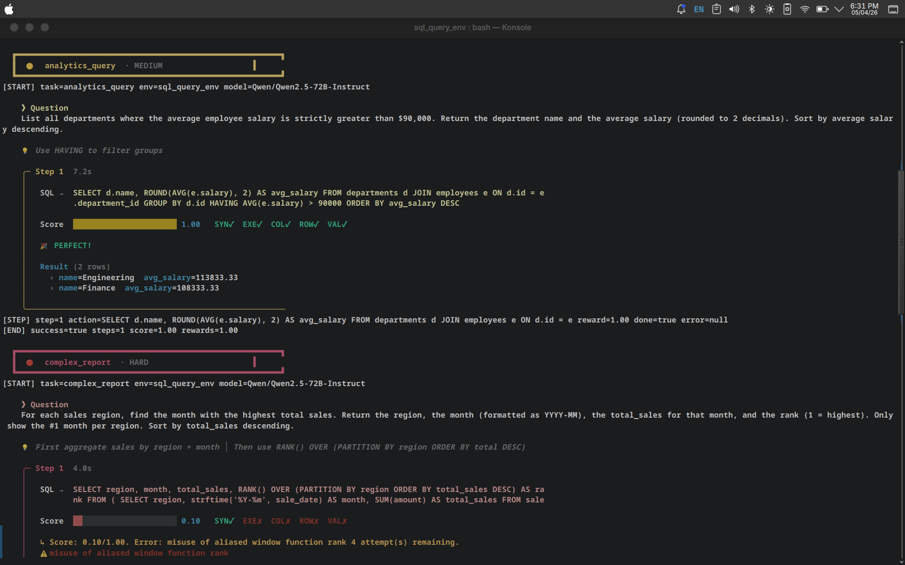
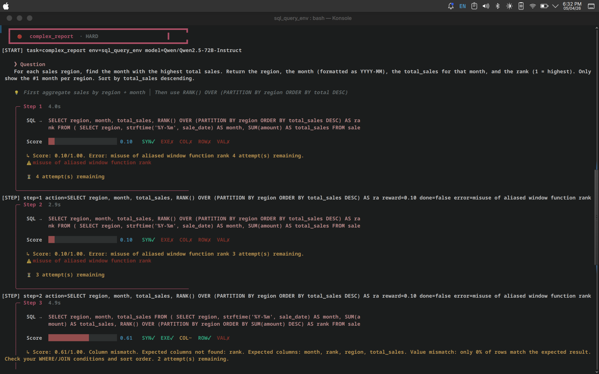
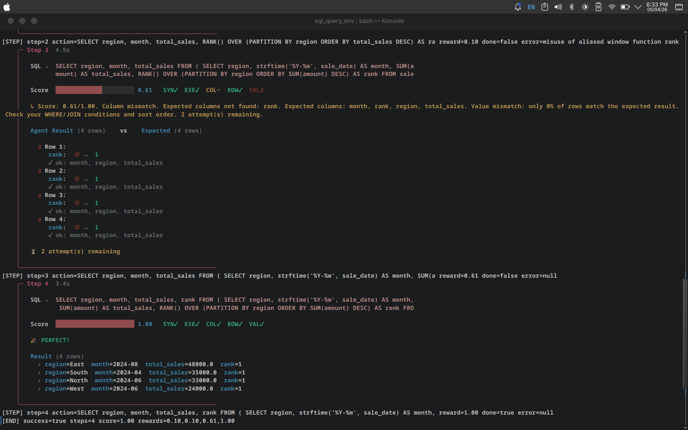
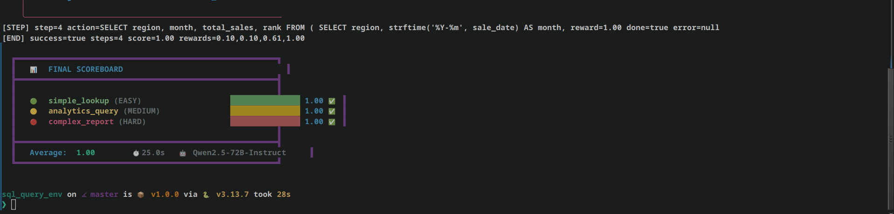

# 🧠 SQL Query Builder — OpenEnv Environment

> **Train AI agents to write SQL queries against a realistic company database.**  
> Built for the [Meta PyTorch OpenEnv Hackathon 2026](https://www.scaler.com/school-of-technology/meta-pytorch-hackathon) · **Team Rocket** 🚀  
> 🔗 [GitHub Repository](https://github.com/GauravGadhari/SQL-Query-Builder-OpenEnv-Environment)

---

## 📸 Demo — Agent in Action

### 🟢 Easy Task — Simple Lookup
The agent receives a natural-language question and writes the SQL in a single step.



### 🟡 Medium Task — Analytics Query
Aggregation queries with GROUP BY, HAVING, and computed columns.



### 🔴 Hard Task — Self-Correction in Action
The hard task challenges the agent with window functions (`RANK()`, `SUM() OVER`). Notice how the agent **fails on step 1** (`score: 0.10`) due to a SQLite alias error, retries, and then our **5-signal grader** provides a detailed row-by-row diff showing exactly what went wrong:



The environment's specific feedback (column mismatches, row diffs) guides the agent to **self-correct** and achieve a perfect `1.00` score by step 4:



### 📊 Final Scoreboard
All three tasks scoring a perfect **1.00** average:



---

## 🌟 What is this?

The SQL Query Builder is a **real-world** OpenEnv environment where AI agents learn to translate natural-language questions into correct SQL queries. It simulates what millions of data analysts do daily — querying relational databases to extract insights.

### Why SQL?
- **Real-world utility**: SQL is one of the most widely-used programming languages in the world. Every data analyst, engineer, and business intelligence professional writes SQL daily.
- **Clear success criteria**: Unlike open-ended tasks, SQL queries have a single correct result — making automated grading precise and fair.
- **Difficulty progression**: From simple `SELECT * WHERE` to complex window functions with CTEs, SQL naturally scales in complexity.
- **Self-correction signal**: Our 5-signal grader gives agents partial credit and specific feedback at every step, enabling genuine learning.

### Key Features
- 📊 **Realistic database**: 5 departments, 20 employees, 30 sales records with proper foreign keys
- 🎯 **21 unique questions** across 3 difficulty tiers (easy → medium → hard)
- ⚖️ **5-signal partial reward** — agents get meaningful feedback at every step, not just pass/fail
- 🔄 **Self-correction loop** — agents get 5 attempts per question with detailed column-level feedback
- 🧹 **Clean isolation** — fresh SQLite in-memory database on every `reset()` call
- ⚡ **Lightweight** — runs on 2 vCPU / 8GB RAM, completes inference in ~15-30 seconds

---

## 🏗️ Project Structure

```
sql_query_env/
├── inference.py                          # Baseline inference script (agent ↔ env loop)
├── models.py                             # Pydantic Action & Observation models
├── client.py                             # WebSocket client wrapper
├── openenv.yaml                          # OpenEnv manifest (spec_version: 1)
├── pyproject.toml                        # Dependencies & metadata
├── README.md                             # You are here
├── assets/                               # Screenshots for documentation
│   ├── 01_easy_task.png
│   ├── 02_medium_task.png
│   ├── 03_hard_task_errors.png
│   ├── 04_hard_task_selfcorrect.png
│   └── 05_scoreboard.png
└── server/
    ├── app.py                            # FastAPI server (step/reset/state endpoints)
    ├── sql_query_env_environment.py      # Core environment logic & episode control
    ├── database.py                       # SQLite schema definition & seed data
    ├── grader.py                         # 5-signal SQL grader (0.0 → 1.0)
    ├── tasks.py                          # 21 task definitions with expected SQL
    └── Dockerfile                        # Production container (multi-stage build)
```

---

## 🚀 Quick Start

### Prerequisites

- Python 3.10+
- [openenv-core](https://pypi.org/project/openenv-core/): `pip install openenv-core`
- An LLM API key (HuggingFace, NVIDIA, OpenAI, Groq, etc.)

### Step 1: Install Dependencies

```bash
cd sql_query_env
pip install -e ".[inference]"
```

### Step 2: Start the Environment Server

```bash
# From inside the sql_query_env/ directory
PYTHONPATH="." uvicorn server.app:app --host 0.0.0.0 --port 8000
```

You should see:
```
INFO:     Application startup complete.
INFO:     Uvicorn running on http://0.0.0.0:8000 (Press CTRL+C to quit)
```

Verify it's working:
```bash
curl http://localhost:8000/health
# → {"status":"healthy"}
```

### Step 3: Configure Environment Variables

```bash
export API_BASE_URL="https://router.huggingface.co/v1"
export MODEL_NAME="Qwen/Qwen2.5-72B-Instruct"
export HF_TOKEN="your-huggingface-api-key"
```

### Step 4: Run the Baseline Inference

In a **separate terminal** (keep the server running):

```bash
cd sql_query_env
PYTHONPATH=".." python inference.py
```

The inference script will:
1. Connect to the environment server via WebSocket
2. Run through all 3 tasks (easy → medium → hard)
3. For each task, the LLM agent reads the question and writes SQL
4. If the agent gets it wrong, the environment provides feedback and the agent retries (up to 5 attempts)
5. Print a final scoreboard with per-task scores

### Step 5: Docker (Production)

```bash
# Build the container (requires BuildKit)
DOCKER_BUILDKIT=1 docker build -t sql-query-env -f server/Dockerfile .

# Run it
docker run -p 8000:8000 sql-query-env

# Verify
curl http://localhost:8000/health
# → {"status":"healthy"}
```

### Step 6: Deploy to Hugging Face Spaces

```bash
openenv push --repo-id your-username/sql-query-env
```

---

## 📋 Tasks & Difficulty

Each task picks a **random question** from its pool on every `reset()`, ensuring variety across runs.

| Task | Difficulty | Questions | SQL Concepts |
|------|:---------:|:---------:|-------------|
| `simple_lookup` | 🟢 Easy | 7 | `SELECT`, `WHERE`, `JOIN`, `ORDER BY`, `IN`, `LIKE` |
| `analytics_query` | 🟡 Medium | 7 | `GROUP BY`, `HAVING`, subqueries, `COUNT`/`AVG`/`SUM`, multi-table joins |
| `complex_report` | 🔴 Hard | 7 | Window functions (`RANK`, `SUM OVER`), CTEs, running totals, `COALESCE` |

### Example Questions by Tier

#### 🟢 Easy — Simple Lookup
> *"Find the employee with email 'alice@company.com'. Return her name and role."*
> 
> Expected: `SELECT name, role FROM employees WHERE email = 'alice@company.com'`

#### 🟡 Medium — Analytics Query
> *"Find the top 3 departments by average salary. Return the department name and average salary."*
> 
> Expected: `SELECT d.name, ROUND(AVG(e.salary), 2) AS avg_salary FROM departments d JOIN employees e ON d.id = e.department_id GROUP BY d.id ORDER BY avg_salary DESC LIMIT 3`

#### 🔴 Hard — Complex Report
> *"Calculate a running cumulative sales total for each salesperson, ordered by sale date. Use SUM() OVER with window frames."*
>
> Expected: Uses `SUM(amount) OVER (PARTITION BY employee_id ORDER BY sale_date ROWS UNBOUNDED PRECEDING)`

---

## ⚖️ Reward Function — 5-Signal Grader

Unlike binary pass/fail grading, our environment provides **partial credit** using 5 independent signals. This gives the agent meaningful learning signal even for partially correct queries.

| Signal | Weight | What it Checks | Example |
|--------|:------:|---------------|---------|
| `syntax_valid` | 10% | Does the SQL parse correctly? | `SELCT` → 0, `SELECT` → 1 |
| `executes` | 15% | Does it run without runtime errors? | Missing table → 0, runs → 1 |
| `correct_columns` | 15% | Are the output column names correct? | `name, role` vs `name, salary` → 0.5 |
| `correct_rows` | 25% | Is the row count correct? | 3 rows vs 5 rows → 0.6 |
| `values_match` | 35% | Do the actual data values match? | 4/5 rows match → 0.8 |

**Total reward** = weighted sum, capped at `[0.0, 1.0]`.

### Why This Design Matters

```
Completely broken SQL          → 0.00 (no signal at all)
Valid syntax but crashes       → 0.10 (at least it parsed!)
Runs but wrong columns         → 0.25 (syntax + execution correct)
Right columns, wrong values    → 0.50 (getting closer)
Almost perfect, 1 row off      → 0.93 (nearly there!)
Perfect match                  → 1.00 🎉
```

> This gradient of rewards means agents learn progressively. Even a poor first attempt provides signal for improvement.

---

## 🔄 How the Agent Loop Works

```
┌─────────────┐     reset(task="simple_lookup")     ┌──────────────────┐
│             │ ──────────────────────────────────── │                  │
│   LLM Agent │                                      │   Environment    │
│  (Qwen/GPT) │     observation: {question, schema}  │  (FastAPI Server)│
│             │ ◄─────────────────────────────────── │                  │
│             │                                      │                  │
│             │     step(action: {query: "SELECT.."})│                  │
│             │ ──────────────────────────────────── │                  │
│             │                                      │  ┌────────────┐  │
│             │     observation: {reward, feedback,   │  │  5-Signal  │  │
│             │       agent_result, expected_result}  │  │   Grader   │  │
│             │ ◄─────────────────────────────────── │  └────────────┘  │
│             │                                      │                  │
│  If reward < 1.0 and attempts remain:             │                  │
│    → Read feedback, fix SQL, retry step()          │                  │
└─────────────┘                                      └──────────────────┘
```

The agent gets up to **5 attempts** per question. On each failed attempt, the environment returns:
- The exact SQL error (if the query crashed)
- Which columns were missing or wrong
- A row-by-row diff showing expected vs actual values
- The remaining attempt count

This makes it possible for the agent to **self-correct** without human intervention.

---

## 🔄 Action & Observation Spaces

### Action (`SqlQueryAction`)

```python
class SqlQueryAction(Action):
    query: str  # SQL query string to execute against the database
```

The agent's only action is submitting a SQL query string. The environment handles execution and grading.

### Observation (`SqlQueryObservation`)

| Field | Type | When | Description |
|-------|------|------|------------|
| `db_schema` | `str` | Always | Full database schema as CREATE TABLE statements |
| `question` | `str` | Always | Natural-language question to answer with SQL |
| `task_name` | `str` | Always | `simple_lookup` · `analytics_query` · `complex_report` |
| `task_difficulty` | `str` | Always | `easy` · `medium` · `hard` |
| `hints` | `list[str]` | Always | Contextual hints (e.g., "Use GROUP BY on the product column") |
| `agent_result` | `list[dict]` | After step | Rows returned by the agent's SQL query |
| `expected_result` | `list[dict]` | After step | Rows from the reference query (for comparison) |
| `feedback` | `str` | After step | Actionable grading feedback with column-level diffs |
| `reward_breakdown` | `dict` | After step | Per-signal scores: `{syntax_valid: 1.0, executes: 0.0, ...}` |
| `error` | `str \| None` | After step | SQLite error message if the query crashed |
| `attempts_remaining` | `int` | Always | Remaining attempts (starts at 5, decreases each step) |
| `done` | `bool` | Always | `true` when agent achieves 1.0 or runs out of attempts |
| `reward` | `float` | After step | Final weighted score `0.0` – `1.0` |

---

## 🗄️ Database Schema

The environment uses an **in-memory SQLite** database that is freshly created on every `reset()` call, ensuring complete episode isolation.

```sql
TABLE: departments
  - id          INTEGER  PRIMARY KEY
  - name        TEXT     -- e.g., Engineering, Sales, Marketing, HR, Finance
  - budget      REAL     -- annual budget in USD
  - location    TEXT     -- e.g., San Francisco, New York, Chicago

TABLE: employees
  - id              INTEGER  PRIMARY KEY
  - name            TEXT     -- e.g., Alice Chen, Bob Miller
  - email           TEXT     -- e.g., alice@company.com
  - department_id   INTEGER  FOREIGN KEY → departments.id
  - salary          REAL     -- annual salary in USD
  - hire_date       TEXT     -- format: YYYY-MM-DD
  - role            TEXT     -- e.g., Senior Engineer, Sales Rep

TABLE: sales
  - id              INTEGER  PRIMARY KEY
  - employee_id     INTEGER  FOREIGN KEY → employees.id
  - amount          REAL     -- sale amount in USD
  - product         TEXT     -- Widget A, Widget B, or Widget C
  - sale_date       TEXT     -- format: YYYY-MM-DD
  - region          TEXT     -- North, South, East, or West
```

### Data Summary
| Table | Rows | Key Fields |
|-------|:----:|------------|
| `departments` | 5 | Engineering, Sales, Marketing, HR, Finance |
| `employees` | 20 | Distributed across all departments with varying salaries |
| `sales` | 30 | Spanning 2024, across all regions and products |

### Relationships
```
employees.department_id  →  departments.id
sales.employee_id        →  employees.id
```

---

## 🔧 Environment Variables

| Variable | Required | Default | Description |
|----------|:--------:|---------|------------|
| `API_BASE_URL` | ✅ | `https://router.huggingface.co/v1` | LLM API endpoint (OpenAI-compatible) |
| `MODEL_NAME` | ✅ | `Qwen/Qwen2.5-72B-Instruct` | Model identifier for inference |
| `HF_TOKEN` | ✅ | — | API key (also accepts `API_KEY` as fallback) |
| `ENV_URL` | ❌ | `http://localhost:8000` | Environment server URL |
| `IMAGE_NAME` | ❌ | — | Docker image name (for `from_docker_image()`) |

---

## 📊 Baseline Scores

Tested with **Qwen/Qwen2.5-72B-Instruct** via HuggingFace Router:

| Task | Score | Steps Used | Time |
|------|:-----:|:----------:|:----:|
| 🟢 `simple_lookup` | **1.00** | 1/5 | ~3s |
| 🟡 `analytics_query` | **1.00** | 1/5 | ~5s |
| 🔴 `complex_report` | **1.00** | 2-4/5 | ~15s |
| **Average** | **1.00** | — | **~25s total** |

> ⏱ Total inference completes in under 30 seconds — well within the 20-minute limit.

---

## 📝 Inference Script — stdout Format

The `inference.py` script emits exactly 3 line types to stdout, strictly following the OpenEnv spec:

```
[START] task=<task_name> env=sql_query_env model=<model_name>
[STEP] step=<n> action=<sql_query> reward=<0.00> done=<true|false> error=<msg|null>
[END] success=<true|false> steps=<n> score=<score> rewards=<r1,r2,...,rn>
```

### Example Run (stdout only)
```
[START] task=simple_lookup env=sql_query_env model=Qwen/Qwen2.5-72B-Instruct
[STEP] step=1 action=SELECT name, role FROM employees WHERE email = 'alice@company.com' reward=1.00 done=true error=null
[END] success=true steps=1 score=1.00 rewards=1.00

[START] task=analytics_query env=sql_query_env model=Qwen/Qwen2.5-72B-Instruct
[STEP] step=1 action=SELECT region, SUM(amount) AS total_amount FROM sales GROUP BY region ORDER BY total_amount DESC reward=1.00 done=true error=null
[END] success=true steps=1 score=1.00 rewards=1.00

[START] task=complex_report env=sql_query_env model=Qwen/Qwen2.5-72B-Instruct
[STEP] step=1 action=SELECT region, month, total_sales, RANK()... reward=0.10 done=false error=misuse of aliased window function rank
[STEP] step=2 action=SELECT region, month, total_sales, rank FROM... reward=1.00 done=true error=null
[END] success=true steps=2 score=1.00 rewards=0.10,1.00
```

> 💡 All colorful debug output (boxes, progress bars, diffs) is sent to `stderr`, keeping `stdout` clean for automated evaluation.

---

## 🧪 Use as Client (Python)

```python
from sql_query_env import SqlQueryAction, SqlQueryEnv

# Async usage
async with SqlQueryEnv(base_url="http://localhost:8000") as env:
    # Reset with a specific task
    result = await env.reset(options={"task": "simple_lookup"})
    obs = result.observation
    
    print(f"Question: {obs.question}")
    print(f"Schema:\n{obs.db_schema}")
    print(f"Hints: {obs.hints}")

    # Submit a query
    result = await env.step(SqlQueryAction(
        query="SELECT name, role FROM employees WHERE email = 'alice@company.com'"
    ))
    
    print(f"Score: {result.reward}")                    # 0.0 - 1.0
    print(f"Breakdown: {result.observation.reward_breakdown}")
    print(f"Feedback: {result.observation.feedback}")
    print(f"Done: {result.done}")
    
    # If not done, agent can retry with corrected SQL
    if not result.done:
        result = await env.step(SqlQueryAction(
            query="SELECT name, role FROM employees WHERE email = 'alice@company.com'"
        ))
```

---

## 🏆 Team Rocket

**Meta PyTorch OpenEnv Hackathon 2026**

| Member | Role | Contributions |
|--------|------|---------------|
| **[Gaurav Gadhari](https://github.com/GauravGadhari)** | Team Lead · Developer · Architect | Environment design, inference engine, reward system, deployment |
| **Gaurav Khokle** | Researcher · Developer | Task design, SQL query research, testing & validation |
| **Aryan Prakash Bargat** | Researcher · Developer | Database schema design, grader logic, documentation |

---

## 📜 License

BSD-3-Clause · Meta Platforms, Inc.
